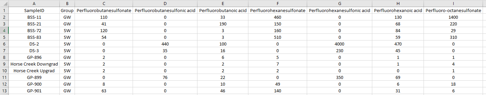

```{r setup, include=FALSE}
knitr::opts_chunk$set(echo = FALSE)
```

# Frequently Asked Questions

### How should I input CSV data?

These are simple yet strict RULES for data input into PCCAT. There is an example below.  
Your file must be a CSV that follows the exact rules below:  

1) The CSV files must be in the form of Column A = SampleID (a unique value for every row), Column B = Group (logical grouping in your data), and Column C = Parameters and beyond.
2) Your first row, Row 1 must have the Header Row as above. Actual data must start on Row 2.
3) All Laboratory Analytical Data should be in the exact same units (organics, inorganics, should be in consistent units, ppt, ppb, ppm).
4) All Laboratory Analytical Data Non-Detects must be treated in the exact same way, i.e., using zero (0) for ND, or $\frac{1}{2}$ the Detection Limit, you must be consistent. Note: Do not use parameters that have more than 75% non-detects in your PCCAT CSV. There is not enough differentiation if the parameter is mostly non-detect.
5) All Data Fields must have a value. Do not leave a data field empty. See the example below:  
&nbsp;  
  
&nbsp;  
In the above Analytical Data Set,  
  + Row 1 is the required Header Row.  
  + Column A holds unique Individual Sample Identifications. (Note: Descriptions are useful for special locations, such as "Horse Creek" in the example)  
  + Column B holds Group Information, i.e., which Samples are Groundwater or Surface Water. Columns C through I are individual parameters in ng/l, with non-detects coded as zero (0).  
  + All cells have a value in them, there are no blanks. Worksheet is saved as a CSV file prior to uploading into PCCAT. Data starts in Column 3.  
  + NOTE: The group Column B is optional, but highly suggested for environmental data. For instance, Group can be location based (Groundwater/Surface Water, Field Blank, Upstream/Downstream) or year based (2002, 2007, 2020), or both (GW_2002, GW_2007, GW_2020, SW_2002, SW_2007, SW_2020). Try to use 2-6 groups to help in the visualization. If you do not include a Group in Column B of your CSV, you must indicate that your parameters start in column 2 in the Data Input tab.

### What are my Data Transformation options?

Use **Standardize** if your data is normally distributed (typical for environmental data).  
Use **Log-Transform** if you know your data is log normally distributed.

### Principle Component Analysis

Principle Component Analysis (PCA) is mostly used as a tool in [exploratory data analysis](https://en.wikipedia.org/wiki/Exploratory_data_analysis) and for making [predictive models](https://en.wikipedia.org/wiki/Predictive_modelling). It is often used to visualize genetic distance and relatedness between populations (wiki).  
A general overview of PCA can be found here (StatQuest 6 minute video): https://www.youtube.com/watch?v=HMOI_lkzW08

### Clustering Analysis

**Cluster analysis** or **clustering** is the task of grouping a set of objects in such a way that objects in the same group (called a **cluster**) are more similar (in some sense) to each other than to those in the other groups (clusters). It is a main task of exploratory [data mining](https://en.wikipedia.org/wiki/Data_mining), and a common technique for [statistical](https://en.wikipedia.org/wiki/Statistics) [data analysis](https://en.wikipedia.org/wiki/Data_analysis), used in many fields, including [pattern recognition](https://en.wikipedia.org/wiki/Pattern_recognition), [image analysis](https://en.wikipedia.org/wiki/Image_analysis), [information retrieval](https://en.wikipedia.org/wiki/Information_retrieval), [bioinformatics](https://en.wikipedia.org/wiki/Bioinformatics), [data compression](https://en.wikipedia.org/wiki/Data_compression), [computer graphics](https://en.wikipedia.org/wiki/Computer_graphics), and [machine learning](https://en.wikipedia.org/wiki/Machine_learning) (wiki).  
A general overview can be found here (StatQuest 11 minute video): https://www.youtube.com/watch?v=7xHsRkOdVwo

### Additional information on Statistics at MSU

Check with MSU-CSTAT for upcoming online and in person classes in R and Statistics at: https://cstat.msu.edu/events

### Additional information on PCCAT use in State of Michigan EGLE

If you need assistance with formatting EGLE Environmental Data and using PCCAT at the State of Michigan, contact Art Ostaszewski (ostaszewskia@michigan.gov) of the Materials Management Division, Hazardous Waste Section.